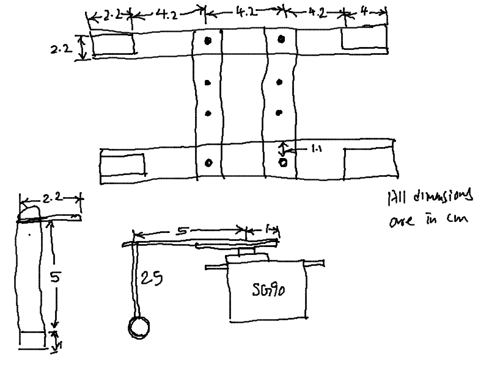

# Remote Controlled Rover 
This is a rover I designed as a part of my final year Minor Project. Both hardware and software, except for the modules and boards available in the market, have been designed completely by me. Over here, I am going to describe this project in brief. 

## Structure of the rover 
The base of the rover is made using PVC pipes having a diameter of 2.22 cm. The diagram for the same is shown below: 
 
On top this structure is fixed a 22.5cm x 12.5cm rectangular piece of hardened cardboard, from which four screws projecting upwards. This allows us to build various levels on top of this rover. Each level can contain its own specialised hardware. For the sake of keeping the centre of gravity of the rover as low as possible for stability reasons, the power source is kept on the lowest level. 

## Description of the software 
The software used in this project can be divided into two parts. 
1. Command interpreter (rpi/main.c): This is an interactive single command interpreter. It majorly consists of the code for a parser. It is written in C. This interpreter, along with shell scripts or python scripts executes various commands which has been entered by the user. For example, the script rpi/interface.py reads the strings that has been passed to it by the parser, sends them serially to Arduino Nano at /dev/ttyUSB0 where they are executed by the controller. The syntax of these commands is somewhat similar to the syntax of assembly instructions.
2. Source code for microcontroller (ardcon/ardcon.ino): Servo motors and motor driver are not controlled by the on-board computer (RPi 3B+) directly. The commands to control the motion of the rover via these motors is sent serially by RPi to Arduino Nano. The code running in Nano then executes these instructions and controls the motors accordingly. ardcon.ino contains string to float function which can translate a string to a floating point value of upto 2 decimal places.

## List of Instructions supported by the interpreter at present 
1. **movf** 
Syntax: 'movf <time in seconds with sign>'
Description: Single operand instruction used to make the rover move forward. Time, in seconds, for which the rover has to be rover has to move forward is passed as an operand.
Example: 'movf +05.00			//moves rover forward for 5 seconds'

2. **movb** 
Syntax: 'movb <time in seconds with sign>'
Description: Similar to movf, but is used to move the rover backwards.

3. **strl**
Syntax: 'strl <angle in degrees>'
Description: Single operand instruction used to turn the steering wheels so that the rover can be turned in left direction. Angle of steer is passed as an argument.
Example: 'strl 05.00			//steer the rover left by 5 degrees'

4. **strr** 
Syntax: 'strr <angle in degrees>'
Description: Similar to strl, but is used to turn the rover towards right side by the angle passed as an argument with the instruction to the interpreter.

5. **exit** 
Syntax: 'exit'
Description: Zero operand instruction used to exit from the interpreter
